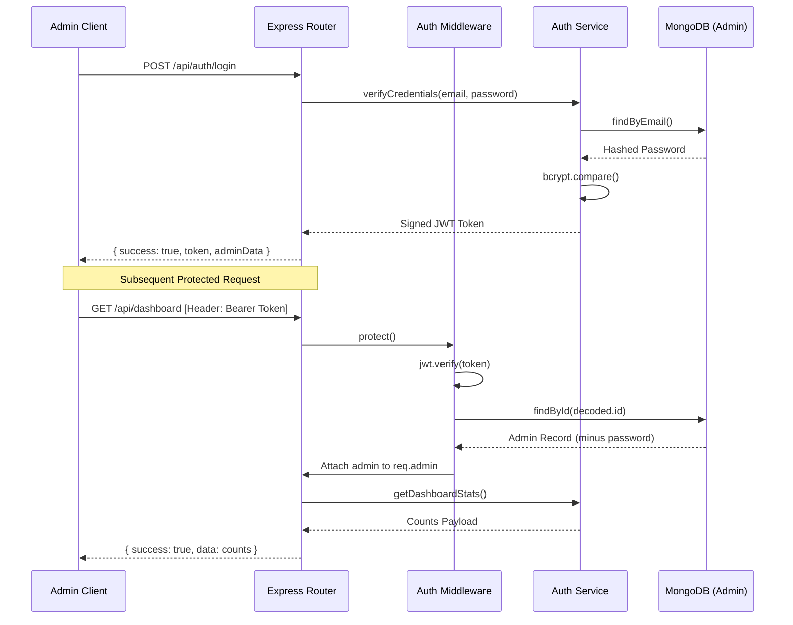

# Project Context & Developer Blueprint

This document serves as the single source of truth for the codebase architecture, patterns, and design decisions of the portfolio showcase REST API. Any future developer or AI agent should read this first before adding features, modifying code, or performing refactoring.

---

## 1. Project Purpose

The backend services a product showcase and portfolio website. It is **NOT** an e-commerce website; there are no shopping carts, checkout logic, payment processing integrations, or buyer account creation flows. Its sole purpose is to expose products, gather contact inquiries, render testimonials, and allow a single administrative account to manage all displayed site content.

---

## 2. Business Requirements

### Client Interface (Public Customers)
*   Browse products with filters (pagination, text searches, category filters).
*   View specific product specs by url-friendly slug.
*   View testimonials aggregated by source (WhatsApp, Instagram, Text).
*   Submit public inquiries via contact forms.
*   Fetch global website settings (business phone, logo, about copy, address).

### Administrative Interface (Single Admin Account)
*   Authenticate using secure login.
*   Recover/reset password via a master security secret or token reset.
*   Access a dashboard displaying statistics (counts of total products, active featured products, testimonials, contacts).
*   Perform full CRUD operations on Products (supports image arrays).
*   Perform full CRUD operations on Testimonials (supports avatar image).
*   View, inspect details of, and delete incoming contact forms.
*   Edit website contact details, about text, logo and home hero banners.

---

## 3. Features & Non-Features

### Implemented Features
1.  **JWT Authentication**: Session-less admin validation.
2.  **Modular Controllers & Services**: Business logic isolated in Services; Controllers handle HTTP formatting.
3.  **Cloudinary-Ready Uploads**: A file helper wraps image saving. If Cloudinary credentials are set, it connects and stores files in the cloud. Otherwise, it gracefully falls back to storing images locally and serving them staticly via `/uploads`.
4.  **Security Measures**: Helmet security headers, CORS origin protection, Express rate limiting, and gzip compression.
5.  **Soft Deletion**: Products are soft deleted (`isDeleted: true`) to preserve references and aggregates, and hidden from public GET endpoints.
6.  **Inputs Validation**: Every POST, PUT, and PATCH endpoint is validated by schemas using `express-validator`.
7.  **Global Error Handling**: A centralized catch-all middleware intercepts Operational errors (`ApiError`), Validation fails, Mongoose schema casts, and JWT token expirations, mapping them to uniform JSON errors.

### Explicit Non-Features (Do Not Implement)
*   Customer registration/login.
*   Checkout/shopping cart.
*   Payment gateway integration (Stripe, PayPal).
*   User roles (RBAC) (only single admin is supported).
*   Real-time notifications (WebSockets).

---

## 4. Architectural Patterns

### Authentication Flow

### Folder Structure & Layer Responsibility
We adhere strictly to a **Three-Tier Architecture**:

1.  **Routing Layer (`src/routes/`)**: Exposes endpoint paths, mounts verification middleware (`protect`), uploads handler (`multer`), and request parameters validation.
2.  **Controller Layer (`src/controllers/`)**: Extremely thin. Intercepts request files/bodies, passes parameters to the service tier, and invokes the `ApiResponse` wrapper.
3.  **Service Layer (`src/services/`)**: Contains all database queries, file-handling operations, error throwing (`ApiError`), and core business logic.
4.  **Database Layer (`src/models/`)**: Pure schema declarations, pre-save slug calculations, database indexing, and static singleton helpers.

---

## 5. Coding & Naming Conventions

*   **Syntax**: ES Modules (`import`/`export`) are standard.
*   **Asynchronous Code**: Always use `async/await` instead of raw promises or callback syntax.
*   **Variable Names**: Use camelCase for variables and function names (e.g. `getFeaturedProducts`).
*   **Model Files**: Singular PascalCase (e.g. `Product.js`, `Testimonial.js`).
*   **Route/Service/Controller Files**: Suffix matching the layer using camelCase (e.g. `productRoutes.js`, `productService.js`, `productController.js`).
*   **Error Catching**: Never write raw `try/catch` blocks inside controllers. Wrap all controllers with the `asyncHandler` wrapper utility to automatically bubble errors down to the global error handler.

---

## 6. Future Expansion Guidelines (Future Ready)

To support future additions without major code refactoring:
*   **Multiple Admins**: The `protect` middleware uses standard database lookups. Should you need multiple admin profiles or roles, you only need to add a `role` field to the `Admin` schema.
*   **E-Commerce**: Products carry fields like colors, sizes, and active statuses. If you transition to e-commerce, you can add an `Inventory` model and link it via a `productId` reference.
*   **Settings Singleton**: Settings are fetched using `Settings.getSettings()`. If settings ever need translation or multi-site scopes, the query inside `getSettings()` can be expanded to filter by host domains.
